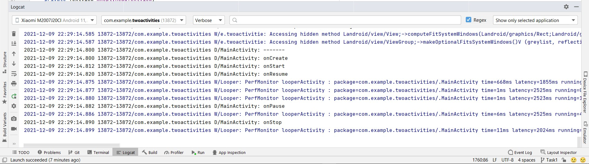
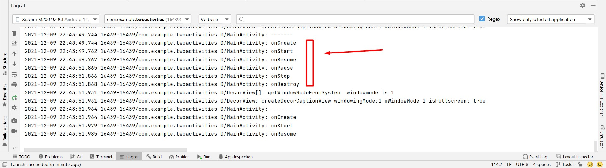

# TwoActivitiesLifecycle - Lab Exercise#
## [Github Link](https://github.com/gauravkharel/TwoActivitiesLifecycle.git) ##

### The task is about Activities and Lifecycle  ##

--From Task 1--

--From Task 2--

